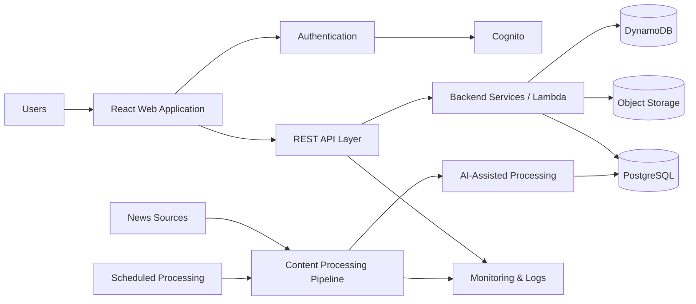

# TechBeetle — Engineering Showcase

> **Production AI content platform · Full-stack engineering · AWS cloud architecture**

TechBeetle is a technology media platform designed to combine modern web publishing with AI-assisted content workflows, backend APIs, cloud infrastructure, authentication, and production observability.

This repository is a **sanitized engineering case study**. The production application and infrastructure source code remain private.

## What I Built

I worked across the application stack, including:

* AI-assisted content and publishing workflows
* frontend application development
* backend REST APIs and domain services
* PostgreSQL-backed data workflows
* authentication and account-management capabilities
* AWS cloud infrastructure
* CI/CD and production deployment
* monitoring, reliability, and production-readiness improvements

The objective was not simply to build a content website, but to evolve it into a more production-oriented platform with clear boundaries between frontend, backend, infrastructure, and AI-assisted workflows.

---

## High-Level Architecture

This diagram is intentionally simplified and excludes private infrastructure identifiers and operational details.

---

## Engineering Areas

### AI & Intelligent Content Workflows

AI is used as part of the content-processing workflow rather than as a standalone chatbot feature.

Engineering considerations include:

* AI-assisted classification and content processing
* structured data passed into AI workflows
* deterministic application logic around model outputs
* separation between AI decisions and core application state
* observability around automated processing
* safeguards for production use

The emphasis is on integrating AI into a reliable application workflow rather than treating model output as automatically trusted.

### Backend Engineering

The backend is structured around API-driven services responsible for application data and business workflows.

Key areas include:

* REST API design
* modular domain routing
* authentication-aware APIs
* PostgreSQL-backed persistence
* input validation
* application-level rate limiting
* error handling and structured logging
* reusable service and repository patterns

A major engineering goal has been to keep domain logic testable and separate from infrastructure-specific adapters.

### AWS Cloud Architecture

The production platform uses AWS services for backend and infrastructure capabilities.

The architecture includes areas such as:

* API Gateway
* serverless compute
* Cognito-based authentication
* PostgreSQL
* object storage
* scheduled workloads
* DynamoDB-backed infrastructure capabilities
* monitoring and alerting

Infrastructure is managed with an environment-aware approach so production and non-production concerns can be isolated.

### Authentication & Security

Authentication and account security are treated as platform capabilities rather than UI-only functionality.

Areas addressed include:

* authenticated API access
* Cognito-backed identity
* MFA-related workflows
* authorization-aware backend operations
* rate limiting and abuse protection
* explicit environment configuration
* secure secret handling outside source control

### Production Engineering

A large part of the work has involved moving from a functioning application toward a production-oriented engineering posture.

Examples include:

* CI verification
* environment parameterization
* route-contract testing
* integration testing
* production deployment workflows
* operational runbooks
* monitoring
* rollback planning
* database and infrastructure reliability work
* staged rollout strategies for high-risk changes

---

## Selected Engineering Decisions

### 1. Keep application logic separate from infrastructure

Backend domain behavior is kept as independent as practical from Lambda/API Gateway adapters.

**Why:**
It improves testability, makes route behavior easier to reason about, and reduces coupling to a specific runtime.

### 2. Treat AI as one component in a deterministic workflow

AI-generated or AI-assisted decisions are surrounded by application rules rather than allowed to control the entire workflow directly.

**Why:**
Production AI requires validation, traceability, and fallback behavior.

### 3. Use layered abuse protection

Protection is applied at multiple levels rather than relying on one mechanism.

Examples include:

* API throttling
* route-specific limits
* application-level controls
* monitoring and alerts

**Why:**
Public APIs need resilience against accidental and intentional traffic spikes.

### 4. Environment-specific infrastructure

Production and staging concerns are separated through explicit environment configuration.

**Why:**
Testing infrastructure changes against production resources creates unnecessary operational risk.

### 5. Observable production systems

Failures and unusual behavior should be visible through structured logs, metrics, and alerts.

**Why:**
A production system is not finished when it deploys; it must also be diagnosable.

---

## Technology Stack

### AI / Data

`OpenAI / LLM APIs` · `AI-assisted content workflows` · `PostgreSQL`

### Frontend

`React` · `TypeScript` · `JavaScript` · `Vite` · `Tailwind CSS`

### Backend

`Node.js` · `TypeScript` · `REST APIs` · `PostgreSQL`

### AWS

`API Gateway` · `Lambda` · `Cognito` · `RDS PostgreSQL` · `S3` · `DynamoDB` · `Fargate` · `CloudWatch`

### Engineering

`GitHub Actions` · `CI/CD` · `Vitest` · `Infrastructure as Code` · `Production Monitoring`

---

## Testing Strategy

Testing spans multiple levels of the system:

**Unit testing**

* domain logic
* utilities
* validation rules

**API / contract testing**

* route behavior
* request/response contracts
* authentication behavior
* negative scenarios

**Integration testing**

* backend-to-database behavior
* PostgreSQL-backed scenarios
* infrastructure-dependent flows where appropriate

**Production verification**

* deployment checks
* health monitoring
* controlled rollout validation

---

## What This Project Demonstrates

This project demonstrates my experience across:

* AI application engineering
* backend architecture
* API development
* database-backed systems
* authentication and authorization
* AWS cloud engineering
* production observability
* testing and CI/CD
* production-readiness assessment
* full-stack product development

---

## Production Source

The production repository is intentionally **private** because it contains proprietary implementation details, infrastructure configuration, operational documentation, and production engineering information.

This public repository is intended to demonstrate the engineering approach without exposing the production system.

---

## Live Product

**TechBeetle:** [techbeetle.org](https://techbeetle.org)

---

## Engineer

**Sri Ranga Bharadwaj Chakilam**
AI Engineer · Backend / Full-Stack Engineer

[Portfolio](https://sriranga.dev) · [GitHub](https://github.com/ranga2002) · [LinkedIn](https://linkedin.com/in/srirangabharadwaj)
